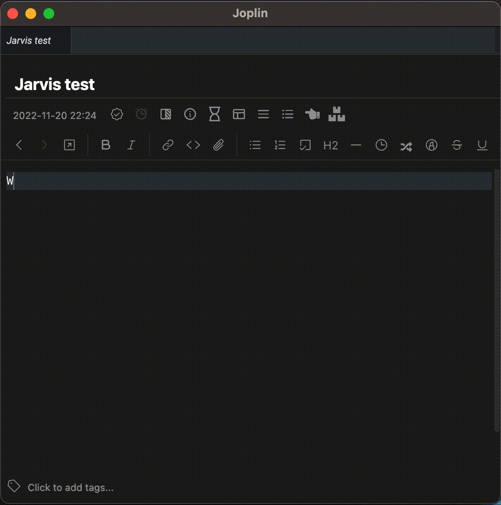

# Jarvis

Jarvis (Joplin Assistant Running a Very Intelligent System) is an AI note-taking assistant powered by OpenAI's GPT-3. You can ask it to [generate text](https://beta.openai.com/docs/guides/completion/introduction), or [edit existing text](https://beta.openai.com/docs/guides/completion/editing-text) based on free text instructions. You will need an OpenAI account for Jarvis to work (at the moment, new users get 18$ credit upon registering, which is equivalent to 900,000 tokens, or more than 600,000 generated words).

## Disclaimer

- This plugin sends your queries to OpenAI (and only to it).
- This plugin uses your OpenAI API key in order to do so (and uses it for this sole purpose).
- You may incur charges (if you are a paying user) from OpenAI by using this plugin.
- Therefore, always check your usage statistics on OpenAI periodically.
- It is also recommended to rotate your API key occasionally.
- The developer is not affiliated with OpenAI in any way.

## Installation

1. Install Jarvis from Joplin's plugin marketplace, or download it from [github](https://github.com/alondmnt/joplin-plugin-jarvis/releases).
2. Setup your [OpenAI account](https://beta.openai.com/signup).
3. Enter your [API key](https://beta.openai.com/account/api-keys) in the plugin settings page.

## Usage

- **Text generation:** Run the command "Ask Jarvis" (from the Tools menu) and write your query in the pop-up window, or select a prompt text in the editor before running the command.
- **Text editing:** Select a text to edit, run the command "Let Jarvis edit selection" (from the Tools menu) and write your instructions in the pop-up window.

## Future directions

- Add resampling techniques to improve output.
- Add support for other AI models.
