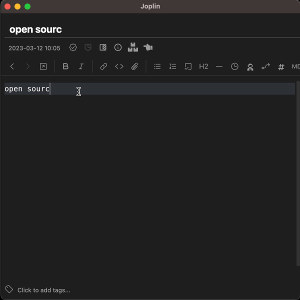

# Jarvis

 

Jarvis (Joplin Assistant Running a Very Intelligent System) is an AI note-taking assistant for [Joplin](https://joplinapp.org), powered by online and offline NLP models (such as OpenAI's ChatGPT or GPT-4, Hugging Face, Universal Sentence Encoder). You can chat with it (including prompt templates), use your personal notes as additional context in the chat, automatically annotate notes, perform semantic search, or compile an [automatic review of the scientific literature](https://medium.com/@alondmnt/ai-powered-literature-review-6918ee180304).

Community discussion: https://discourse.joplinapp.org/t/28316

## Usage

- **Chat:**
    - Start a new note, or continue an existing conversation in a saved note. Place the cursor after your prompt and run the command `Chat with Jarvis` (from the toolbar or Tools/Jarvis menu). Each time you run the command Jarvis will append its response to the note at the current cursor position (given the previous content that both of you created). If you don't like the response, run the command again to replace it with a new one.
- **Chat with your notes:**
    - To add additional context to your conversation based on your notes, repeat the steps above but select the command `Chat with your notes` (from the Tools/Jarvis menu) instead. Relevant short excerpts from your notes will be sent to the chat model in addition to the usual conversation prompt / context. To exclude certain notes from this feature, add the tag `#exclude.from.jarvis` to the notes you wish to exclude. You may combine regular chat and note-based chat on the same note. For more information see [this guide](GUIDE.md#chat-with-your-notes).
- **Related notes:**
    - Find notes based on semantic similarity to the currently open note, or to selected text. By default, this is done locally (offline), without sending the content of your notes to a remote server (online models can be selected). Notes are displayed in a dedicated panel. To run semantic search based on selected text, click on the `Find related notes` (toolbar button or context menu option).
- **Annotate your notes:**
    - Run the command `Annotate note with Jarvis` to add annotations to your notes: title, summary, links and / or tags. For more information see [this guide](GUIDE.md#annotate-note-with-jarvis).
- **Literature review:**
    - Run the command `Research with Jarvis`, write what you're interested in, and optionally adjust the search parameters. Wait 2-3 minutes for all the output to appear in the note (depending on internet traffic). Jarvis will update the content as it finds new information on the web (using Semantic Scholar, Crossref, Elsevier, Springer & Wikipedia databases). In the end you will get a report with the following sections: title, prompt, research questions, queries, references, review and follow-up questions. For more information see [this post](https://medium.com/@alondmnt/ai-powered-literature-review-6918ee180304).
- **Autocomplete anything:**
    - `Chat with Jarvis` will try to extend any content. Therefore, this essentially serves as a general-purpose autocomplete command. You can remove the speaker attribution ("User:") by cleaning the `response suffix` field in the settings. The `text-davinci-003` model is recommended for this use case.
- **Text generation:**
    - Run the command `Ask Jarvis` and write your query in the pop-up window, or select a prompt text in the editor before running the command. You can also enhance your query with predefined (or customized) prompt templates from the dropdown lists.
- **Text editing:**
    - Select a text to edit, run the command `Edit selection with Jarvis` and write your instructions in the pop-up window.

## Installation

1. Install Jarvis from Joplin's plugin marketplace, or download it from [github](https://github.com/alondmnt/joplin-plugin-jarvis/releases).
2. Select a model for chatting with Jarvis, and a model for indexing your notes. If you prefer OpenAI's models, you will need an [OpenAI account](https://platform.openai.com/signup), and an [API key](https://platform.openai.com/account/api-keys) that can be defined in the plugin settings.
3. To improve chat coherence, it may be helpful to increase `Memory tokens` in the settings, especially when chatting with your notes.
4. For literature reviews, you can optionally add free API keys for [Scopus/Elsevier](https://dev.elsevier.com/) as an additional powerful search engine and paper repository, and [Springer](https://dev.springernature.com/) as another paper repository. It is recommended to try both Scopus and Semantic Scholar as each has its pros and cons.

## Disclaimer

- This plugin sends your queries to your selected models (and only to these ones, whether they are online or offline models). Research queries are also sent to the selected literature search engine (Semantic Scholar / Scopus).
- This plugin may use your OpenAI or Hugging Face API key in order to do so (and uses it for this sole purpose).
- You may incur charges (if you are a paying user) from OpenAI by using this plugin.
- Therefore, always check your usage statistics on OpenAI periodically.
- It is also recommended to rotate your API keys occasionally.
- The developer is not affiliated with any of these services.
