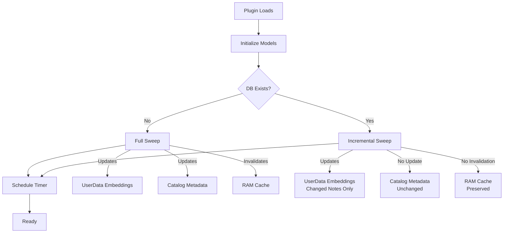
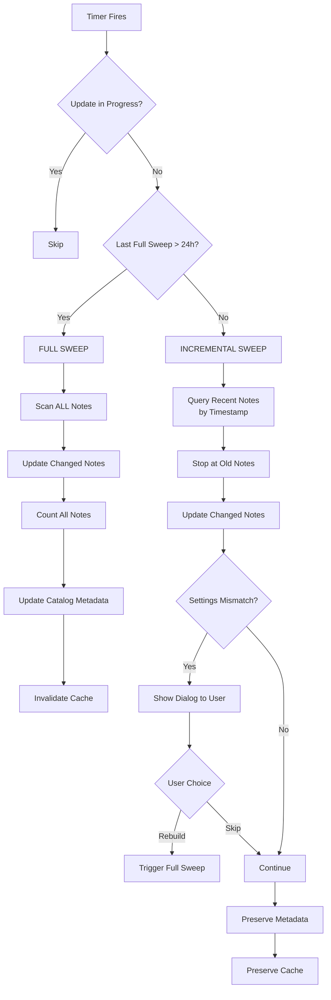
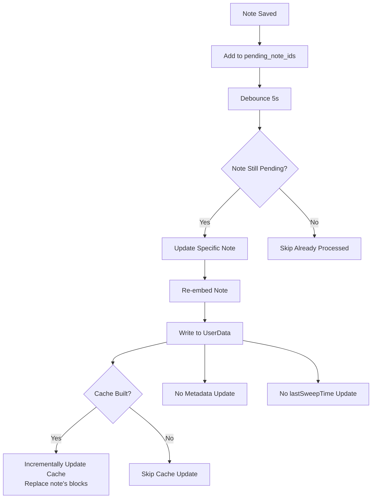
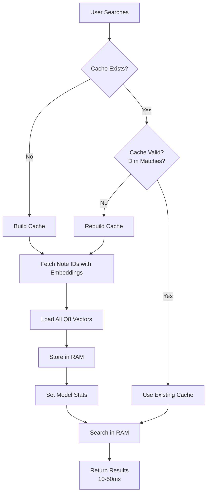
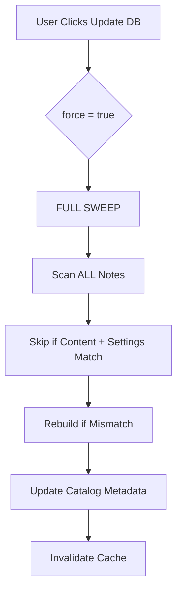
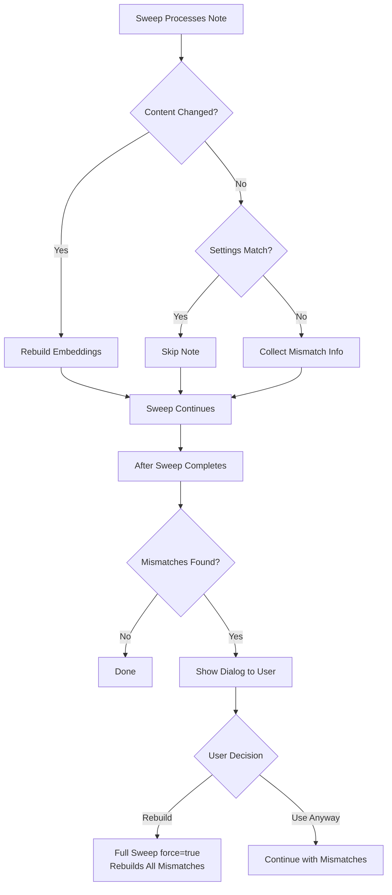
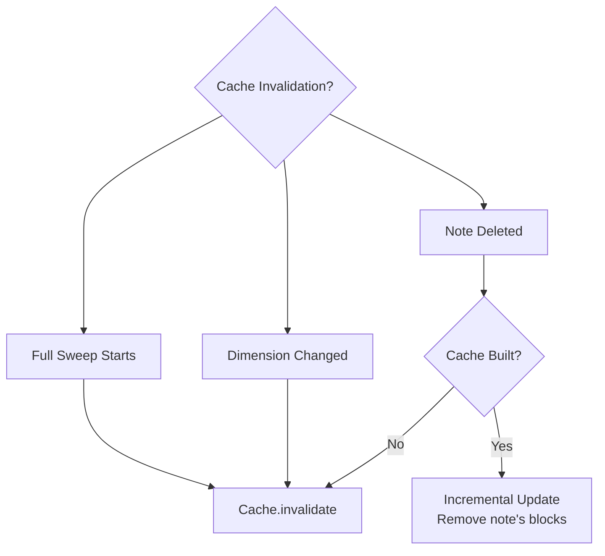

# Database Update and Caching Flow

This document describes when database updates are triggered and what gets updated/cached as a result.

## System Overview

```
┌─────────────────────────────────────────────────────────────────────┐
│                         JARVIS DATABASE SYSTEM                      │
│                                                                     │
│  ┌──────────────────┐    ┌──────────────────┐   ┌──────────────┐    │
│  │  Note UserData   │    │  Catalog Note    │   │  RAM Cache   │    │
│  │  (embeddings)    │◄───│  (metadata)      │◄──│  (Q8 search) │    │
│  └──────────────────┘    └──────────────────┘   └──────────────┘    │
│                                                                     │
└─────────────────────────────────────────────────────────────────────┘
```

## Trigger Events and Consequences

### 1. Plugin Startup



**What happens:**
- **Initial sweep** runs in background
  - First time: Full sweep (scans all notes)
  - Subsequent: Incremental sweep (only changed notes)
- **Timer scheduled** for periodic sweeps
- **Cache NOT built** yet (waits for first search)

**What gets updated:**
- ✅ UserData embeddings (new/changed notes only if incremental)
- ✅ Catalog metadata (only if full sweep)
- ❌ RAM cache (not built until first search)

---

### 2. Periodic Timer (Every N Minutes)



**Decision Logic:**
```typescript
const lastFullSweepTime = await get_model_last_full_sweep_time(modelId);
const now = Date.now();
const ONE_DAY_MS = 24 * 60 * 60 * 1000;

const needsFullSweep = lastSweepTime === 0 || (now - lastFullSweepTime) > ONE_DAY_MS;
```

**What gets updated:**

**Full Sweep (once per day):**
- ✅ UserData embeddings (all changed notes)
- ✅ Catalog metadata (rowCount, noteCount, dim)
- ✅ lastFullSweepTime timestamp
- ⚠️ RAM cache (invalidated, rebuilds on next search)

**Incremental Sweep (rest of the time):**
- ✅ UserData embeddings (recently changed notes only)
- ✅ Settings validation (checks embeddings match current settings)
- ✅ lastSweepTime timestamp
- ⚠️ **User dialog** if settings mismatches detected (e.g., synced from another device)
  - User can choose to rebuild mismatched notes immediately
  - Or continue using mismatched embeddings
- ❌ Catalog metadata (unchanged unless user triggers rebuild)
- ❌ RAM cache (preserved unless user triggers rebuild)

---

### 3. User Edits Note



**What happens:**
- Note ID added to `pending_note_ids` set
- Debounced update triggered (5 second delay)
- Only the specific note is re-embedded
- Cache is **incrementally updated** (not rebuilt)

**What gets updated:**
- ✅ UserData embeddings (this note only)
- ✅ RAM cache (incrementally - note's blocks replaced)
- ❌ Catalog metadata (unchanged - drift corrected by daily full sweep)
- ❌ lastSweepTime (unchanged)

---

### 4. User Searches for Related Notes



**Cache Build Process:**
```typescript
// Only fetches note IDs when cache needs building
if (!cache.isBuilt() || cache.getDim() !== queryDim) {
  const result = await get_all_note_ids_with_embeddings(modelId, ...);
  await cache.ensureBuilt(...);
}

// Subsequent searches skip this entirely
const results = cache.search(queryQ8, k, minScore);
```

**What happens:**
- **First search:** Cache built (2-5 seconds)
- **Subsequent searches:** Pure RAM search (10-50ms)

**What gets updated:**
- ✅ RAM cache (all Q8 vectors loaded)
- ✅ Model stats in memory (rowCount, noteCount, dim)
- ❌ UserData embeddings (unchanged)
- ❌ Catalog metadata (unchanged)

---

### 5. Manual "Update DB" Command



**What happens:**
- Forces **full sweep** with `force=true`
- Checks content hash + settings + model version
- Rebuilds notes where any mismatch detected
- Always updates catalog metadata

**What gets updated:**
- ✅ UserData embeddings (all mismatched notes)
- ✅ Catalog metadata (always updated)
- ✅ lastFullSweepTime (reset)
- ⚠️ RAM cache (invalidated, rebuilds on next search)

---

## Settings Mismatch Detection

The system automatically detects when embeddings were created with different settings than the current configuration. This commonly happens when syncing between devices with different settings.



**Detection Timing:**

| Scenario | Detection Window | Action |
|----------|-----------------|---------|
| **Recently synced notes** | Next incremental sweep (≤30 min) | User prompted immediately |
| **Old synced notes** | Daily full sweep (≤24h) | User prompted |
| **Settings changed locally** | Immediate | Force rebuild triggered |

**What gets checked:**
- `embedTitle` (include note title in embeddings)
- `embedPath` (include folder path in embeddings)
- `embedHeading` (include heading in embeddings)
- `embedTags` (include tags in embeddings)
- `includeCode` (include code blocks)
- `maxTokens` (maximum tokens per block)

**Mismatch dialog example:**
```
Found 15 note(s) with different embedding settings (likely synced from another device).

Settings: embedTitle No→Yes, maxTokens 512→1024

Rebuild these notes with current settings?
[OK] [Cancel]
```

**Important notes:**
- Only checks notes that are processed during the sweep (recently changed or all notes in full sweep)
- Old, unchanged notes are only validated during daily full sweeps
- Mismatches don't affect correctness, just embedding quality/consistency
- User can choose to rebuild immediately or defer to next full sweep

**Code references:**
- Detection: embeddings.ts:613-629
- Dialog: notes.ts:396-422

---

## Cache Invalidation Rules

The RAM cache is invalidated (cleared) in these cases:



**Invalidation triggers:**
1. ❌ **Full sweep starts** → Complete rebuild on next search
2. ❌ **Model changed** (dimension mismatch) → Complete rebuild
3. ⚠️ **Note deleted** → Incremental update (remove blocks)

**NOT invalidated by:**
- ✅ Incremental sweeps
- ✅ Individual note updates
- ✅ Note edits (incrementally updated instead)

---

## Data Flow Architecture

```
┌────────────────────────────────────────────────────────────────────┐
│                          TRIGGER EVENTS                            │
├────────────┬───────────────┬──────────────┬────────────────────────┤
│  Startup   │  Timer (24h)  │  Note Edit   │  Search                │
└────┬───────┴───────┬───────┴──────┬───────┴────────┬───────────-───┘
     │               │              │                │
     │               ▼              ▼                ▼
     │         ┌──────────┐   ┌──────────┐    ┌──────────┐
     │         │   FULL   │   │ SPECIFIC │    │  CACHE   │
     └────────►│  SWEEP   │   │   NOTE   │    │  BUILD   │
               │ (daily)  │   │  UPDATE  │    │ (first)  │
               └────┬─────┘   └────┬─────┘    └────┬─────┘
                    │              │               │
     ┌──────────────┼──────────────┼───────────────┤
     │              │              │               │
     ▼              ▼              ▼               ▼
┌─────────-┐   ┌─────────┐   ┌─────────┐   ┌──────────────┐
│ UserData │   │ Catalog │   │Incr.    │   │ Model Stats  │
│Embeddings◄──-┤Metadata │   │Cache    │   │  (in-mem)    │
│(per note)│   │(global) │   │Update   │   │              │
└─────────-┘   └─────────┘   └─────────┘   └──────────────┘
     │              │              │               │
     └──────────────┴──────────────┴───────────────┘
                          │
                          ▼
                  ┌──────────────┐
                  │  RAM CACHE   │
                  │ (Q8 vectors) │
                  │   10-50ms    │
                  └──────────────┘
```

---

## Update Frequency Summary

| Event | Frequency | Full Sweep? | Metadata? | Cache? | Settings Check? |
|-------|-----------|-------------|-----------|--------|-----------------|
| **Startup** | Once | Only if first time | Only if full | Not built | Only if full |
| **Periodic (Timer)** | Every N min | Once per 24h | Once per 24h | Invalidated daily | Yes (all processed notes) |
| **Note Edit** | Per save | No | No | Incrementally updated | No |
| **Search** | On demand | No | No | Built if needed | No |
| **Manual Update** | User action | Yes | Yes | Invalidated | Yes (all notes) |

---

## Code References

### Key Functions

- **Full Sweep:** `update_note_db(..., incrementalSweep=false)` → notes.ts:232
- **Incremental Sweep:** `update_note_db(..., incrementalSweep=true)` → notes.ts:172
- **Cache Build:** `cache.ensureBuilt(...)` → embeddingCache.ts:153
- **Cache Search:** `cache.search(queryQ8, k, minScore)` → embeddingCache.ts:278
- **Metadata Update:** `write_model_metadata(...)` → notes.ts:340
- **Timer Logic:** `schedule_full_sweep_timer(...)` → index.ts:267

### Decision Points

```typescript
// When to do full sweep (index.ts:289)
const needsFullSweep = lastSweepTime === 0 || (now - lastFullSweepTime) > ONE_DAY_MS;

// When to fetch note IDs (embeddings.ts:1360)
if (!cache.isBuilt() || cache.getDim() !== queryDim) {
  const result = await get_all_note_ids_with_embeddings(...);
}

// When to update metadata (notes.ts:311)
if (isFullSweep && !incrementalSweep) {
  await write_model_metadata(...);
}
```
