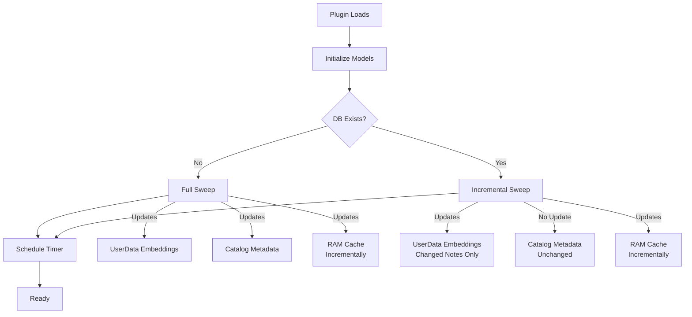
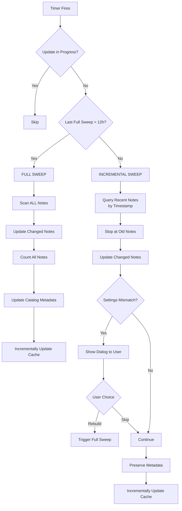
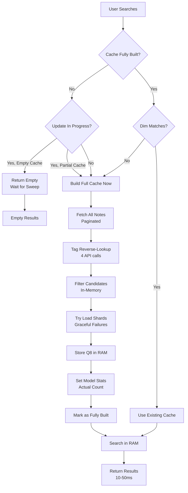
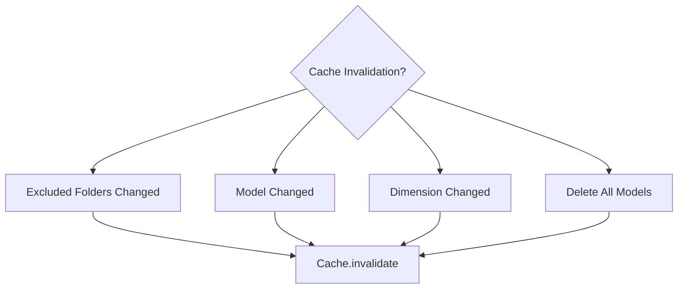

# Database Update and Caching Flow

This document describes when database updates are triggered and what gets updated/cached as a result.

## System Overview

```
┌─────────────────────────────────────────────────────────────────────┐
│                         JARVIS DATABASE SYSTEM                      │
│                                                                     │
│  ┌──────────────────┐    ┌──────────────────┐   ┌──────────────┐    │
│  │  Note UserData   │    │  Catalog Note    │   │  RAM Cache   │    │
│  │  (embeddings)    │◄───│  (metadata)      │◄──│  (Q8 search) │    │
│  └──────────────────┘    └──────────────────┘   └──────────────┘    │
│                                                                     │
└─────────────────────────────────────────────────────────────────────┘
```

## Trigger Events and Consequences

### 1. Plugin Startup



**What happens:**
- **Initial sweep** runs in background
  - First time: Full sweep (scans all notes)
  - Subsequent: Incremental sweep (only changed notes)
- **Timer scheduled** for periodic sweeps
- **Cache NOT built** yet (waits for first search)

**What gets updated:**
- ✅ UserData embeddings (new/changed notes only if incremental)
- ✅ Catalog metadata (only if full sweep)
- ❌ RAM cache (not built until first search)

---

### 2. Periodic Timer (Every N Minutes)



**Decision Logic:**
- Full sweep needed if: never done before OR more than 12 hours since last full sweep
- Otherwise: incremental sweep (only recently changed notes)

**What gets updated:**

**Full Sweep (every 12 hours):**
- ✅ UserData embeddings (all changed notes)
- ✅ Catalog metadata (rowCount, noteCount, dim)
- ✅ lastFullSweepTime timestamp
- ✅ RAM cache (incrementally updated for all processed notes)
- ✅ Exclusion cleanup (tag/conflict exclusions remove embeddings; folder exclusions preserve them)

**Incremental Sweep (rest of the time):**
- ✅ UserData embeddings (recently changed notes only)
- ✅ RAM cache (incrementally updated for all processed notes, including unchanged ones)
- ✅ Settings validation (checks embeddings match current settings)
- ✅ lastSweepTime timestamp
- ⚠️ **User dialog** if settings mismatches detected (e.g., synced from another device)
  - User can choose to rebuild mismatched notes immediately
  - Or continue using mismatched embeddings
- ❌ Catalog metadata (unchanged unless user triggers rebuild)

**Cache Strategy:**
- Incremental sweeps keep cache fresh by updating it for ALL processed notes (even unchanged ones)
- This catches newly synced notes without expensive full cache rebuilds
- Fast and unnoticeable on mobile (vs 20-30 sec for full cache rebuild)

---

### 3. User Edits Note


**What happens:**
- Note ID added to `pending_note_ids` set
- Debounced update triggered (5 second delay)
- Only the specific note is re-embedded
- Cache is **incrementally updated** (not rebuilt)

**What gets updated:**
- ✅ UserData embeddings (this note only)
- ✅ RAM cache (incrementally - note's blocks replaced)
- ❌ Catalog metadata (unchanged - drift corrected by daily full sweep)
- ❌ lastSweepTime (unchanged)

---

### 4. User Searches for Related Notes



**Cache Build Process (Two Phases):**

Builds cache when needed:
- **First search** (cache empty or not fully built)
- **Dimension change** (model switched)
- **Partial cache during incremental sweep** (NEW: ensures complete results immediately)

**Phase 1: Fetch and Filter (silent - fast)**
1. Fetch exclusion tags once via reverse-lookup
2. Paginate through all notes (100 per page)
3. For each note: count total, check exclusions, collect candidate IDs
4. Track: totalNotes, excludedCount, candidateIds

**Phase 2: Load Embeddings (with progress)**
1. Try loading shards for all candidate IDs
2. `getShard` returns null if no embeddings → skip gracefully
3. Update progress bar every 10 notes loaded
4. Progress formula: `(excludedCount + loaded) / totalNotes`
5. Example: 63 excluded, 999 with embeddings, 1062 total
   - Shows: 73/1062, 163/1062, ..., 1062/1062

**Subsequent searches:**
- Skip both phases entirely
- Pure RAM search using cached Q8 vectors (10-50ms)

**Performance (example: 5000 notes, 3000 with embeddings):**

| Step | API Calls | Description |
|------|-----------|-------------|
| Fetch notes (paginated) | 50 | 100 notes per page |
| Tag reverse-lookup | 4 | Query notes by exclusion tags |
| Filter candidates | 0 | In-memory using response data |
| Try load metadata | 4,500 | One per candidate (inside getShard) |
| Load shards | 3,000 | Only for notes with embeddings |
| **Total** | **7,554** | **~45 seconds** |

**Key characteristics:**
- ✅ **Tag reverse-lookup**: Single query per exclusion tag (not per note)
- ✅ **Graceful failure handling**: getShard returns null if no embeddings exist
- ✅ **Single-pass architecture**: Metadata fetched once (inside getShard)
- ✅ **Two-phase progress**: Phase 1 silent (fast fetch/filter), Phase 2 shows progress (embedding load)
- ✅ **Total notes denominator**: Progress bar always shows X/1062 (matches full sweep UX)

**What happens:**
- **First search (cache empty):** Cache built with progress bar (2-5 seconds on desktop, 5-15 seconds on mobile)
- **Search during full sweep (cache empty):** Returns empty results, sweep builds cache incrementally
- **Search during incremental sweep (partial cache):** **NEW** - Builds full cache immediately with progress bar (5-15 seconds on mobile)
- **Subsequent searches:** Pure RAM search (10-50ms)
- **Progress indicator:** Phase 1 silent (fast), Phase 2 shows X/totalNotes progress every 10 embeddings loaded

**What gets updated:**
- ✅ RAM cache (all Q8 vectors for notes with embeddings)
- ✅ Model stats in memory (actual rowCount, noteCount, dim)
- ❌ UserData embeddings (unchanged)
- ❌ Catalog metadata (unchanged)

---

### 5. Manual "Update DB" Command


**What happens:**
- Forces **full sweep** with `force=true`
- Checks content hash + settings + model version
- Rebuilds notes where any mismatch detected
- Always updates catalog metadata

**What gets updated:**
- ✅ UserData embeddings (all mismatched notes)
- ✅ Catalog metadata (always updated)
- ✅ lastFullSweepTime (reset)
- ⚠️ RAM cache (invalidated, rebuilds on next search)

---

## Settings Mismatch Detection

The system automatically detects when embeddings were created with different settings than the current configuration. This commonly happens when syncing between devices with different settings.


**Detection Timing:**

| Scenario | Detection Window | Action |
|----------|-----------------|---------|
| **Recently synced notes** | Next incremental sweep (≤30 min) | User prompted immediately |
| **Old synced notes** | Daily full sweep (≤12h) | User prompted |
| **Settings changed locally** | Immediate | Force rebuild triggered |

**What gets checked:**
- `embedTitle` (include note title in embeddings)
- `embedPath` (include folder path in embeddings)
- `embedHeading` (include heading in embeddings)
- `embedTags` (include tags in embeddings)
- `includeCode` (include code blocks)
- `maxTokens` (maximum tokens per block)

**Mismatch dialog:**
- Shows count of mismatched notes and which settings differ
- User can choose to rebuild immediately or continue with mismatches
- Example: "Found 15 note(s) with different embedding settings (likely synced from another device)"

**Important notes:**
- Only checks notes that are processed during the sweep (recently changed or all notes in full sweep)
- Old, unchanged notes are only validated during daily full sweeps (every 12 hours)
- Mismatches don't affect correctness, just embedding quality/consistency
- User can choose to rebuild immediately or defer to next full sweep

---

## Cache State Tracking

**NEW (v0.11.1+):** The cache now distinguishes between two states:

### Partial Cache (Incrementally Building)
- **How it happens:** Incremental sweeps add recently modified notes one-by-one
- **Characteristics:**
  - Has dimension set
  - Contains some blocks (e.g., 5-10 notes)
  - Flag `_builtViaEnsureBuilt = false`
- **Search behavior:** Triggers full cache build with progress bar

### Fully Built Cache
- **How it happens:** Search calls `ensureBuilt()` to load all notes at once
- **Characteristics:**
  - Has complete corpus
  - Contains all notes with embeddings
  - Flag `_builtViaEnsureBuilt = true`
- **Search behavior:** Uses existing cache (10-50ms)

**Why this matters:**

Before this change (mobile startup issue):
1. Incremental sweep adds 5 notes → Cache appears "built"
2. User searches → Uses incomplete cache
3. Shows 5 results instead of 10 (confusing UX)

After this change:
1. Incremental sweep adds 5 notes → Cache is "partially built"
2. User searches → Detects incomplete cache
3. **Builds full cache with progress bar** (5-15 seconds)
4. Shows complete 10 results immediately

**Race condition protection:** If `ensureBuilt()` is running, `updateNote()` waits for it to complete to avoid buffer corruption.

---

## Cache Invalidation Rules

The RAM cache is invalidated (cleared) in these cases:



**Invalidation triggers (complete rebuild on next search):**
1. ❌ **Excluded folders changed** (settings change)
2. ❌ **Model switched** (user selects different model)
3. ❌ **Dimension mismatch** (model updated with different dim)
4. ❌ **Delete all models** (user action)

**NOT invalidated by (incremental updates instead):**
- ✅ Full sweeps (cache updated incrementally for all processed notes)
- ✅ Incremental sweeps (cache updated incrementally for recently changed notes)
- ✅ Individual note updates (cache updated incrementally)
- ✅ Note edits (cache updated incrementally)
- ✅ Note deletions (blocks removed incrementally)
- ✅ Sync operations (cache kept fresh via incremental sweeps)

**Note about exclusions:**
- Adding/removing exclusions does NOT invalidate cache
- **Tag/conflict exclusions:** userData embeddings deleted, cache updated
- **Folder exclusions:** userData embeddings **preserved** (device-specific setting, not synced), cache still filters them from search
- **If cache not rebuilt AND note not processed by sweep:** Excluded note may remain in search results until next cache rebuild or full sweep

---

## Data Flow Architecture

```
┌────────────────────────────────────────────────────────────────────┐
│                          TRIGGER EVENTS                            │
├────────────┬───────────────┬──────────────┬────────────────────────┤
│  Startup   │  Timer (12h)  │  Note Edit   │  Search                │
└────┬───────┴───────┬───────┴──────┬───────┴────────┬───────────-───┘
     │               │              │                │
     │               ▼              ▼                ▼
     │         ┌──────────┐   ┌──────────┐    ┌──────────┐
     │         │   FULL   │   │ SPECIFIC │    │  CACHE   │
     └────────►│  SWEEP   │   │   NOTE   │    │  BUILD   │
               │ (daily)  │   │  UPDATE  │    │ (first)  │
               └────┬─────┘   └────┬─────┘    └────┬─────┘
                    │              │               │
     ┌──────────────┼──────────────┼───────────────┤
     │              │              │               │
     ▼              ▼              ▼               ▼
┌─────────-┐   ┌─────────┐   ┌─────────┐   ┌──────────────┐
│ UserData │   │ Catalog │   │Incr.    │   │ Model Stats  │
│Embeddings◄──-┤Metadata │   │Cache    │   │  (in-mem)    │
│(per note)│   │(global) │   │Update   │   │              │
└─────────-┘   └─────────┘   └─────────┘   └──────────────┘
     │              │              │               │
     └──────────────┴──────────────┴───────────────┘
                          │
                          ▼
                  ┌──────────────┐
                  │  RAM CACHE   │
                  │ (Q8 vectors) │
                  │   10-50ms    │
                  └──────────────┘
```

---

## Update Frequency Summary

| Event | Frequency | Full Sweep? | Metadata? | Cache? | Settings Check? |
|-------|-----------|-------------|-----------|--------|-----------------|
| **Startup** | Once | Only if first time | Only if full | Not built | Only if full |
| **Periodic (Timer)** | Every N min | Once per 12h | Once per 12h | Incrementally updated | Yes (all processed notes) |
| **Note Edit** | Per save | No | No | Incrementally updated | No |
| **Search** | On demand | No | No | **Full build if empty/partial/dim-mismatch** | No |
| **Manual Update** | User action | Yes | Yes | Incrementally updated | Yes (all notes) |

---

## Key Decision Points

**When to do full sweep:**
- Never done before (lastSweepTime === 0), OR
- More than 12 hours since last full sweep

**When to build cache:**
- Cache not fully built yet (`_builtViaEnsureBuilt = false`), OR
- Dimension mismatch (model changed), OR
- Cache has partial data from incremental sweep

**When to skip cache build during search:**
- Update in progress (sweep running), AND
- Cache is completely empty (no blocks yet)
- This allows full sweeps to build cache incrementally without blocking searches

**When to update catalog metadata:**
- Full sweeps only (not incremental sweeps)
